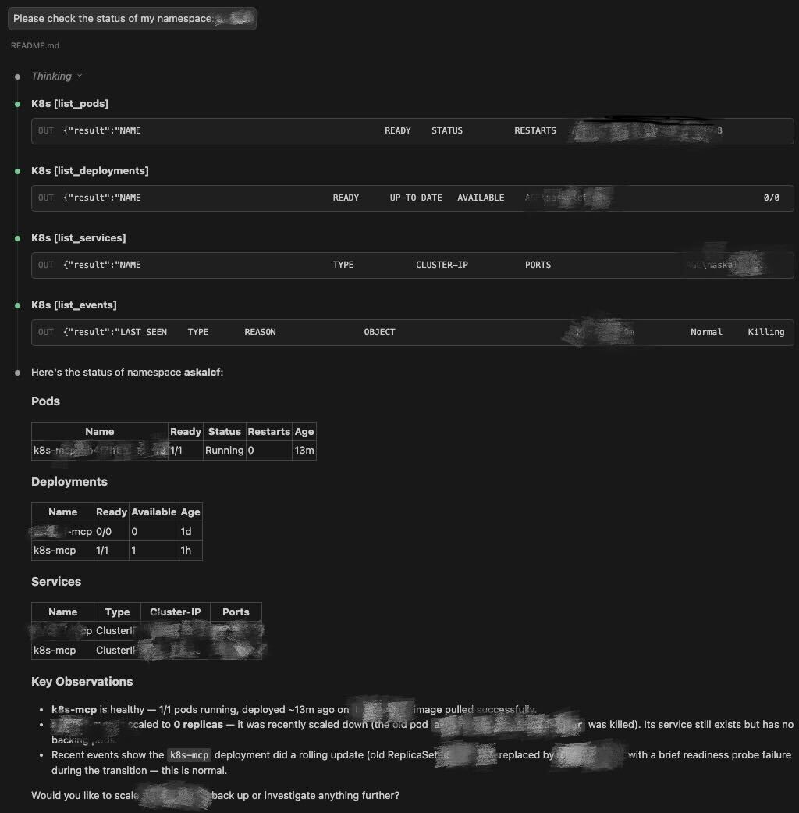

# k8s-mcp

A [Model Context Protocol (MCP)](https://modelcontextprotocol.io/) server that exposes Kubernetes operations as tools for AI assistants. It lets AI agents like Claude directly query and manage your Kubernetes cluster through natural language.

## Why use this?

AI assistants without k8s-mcp can only suggest `kubectl` commands for you to copy-paste. With k8s-mcp, they can:

- **Secure by design** — reuses your existing `~/.kube/config`, which is authenticated through your organization's auth flow (e.g., SSO, OIDC, certificate). The server never stores, transmits, or manages credentials itself
- **Query and diagnose in real time** — list pods, read logs, inspect events, and check deployment status without leaving the conversation
- **Take actions on your behalf** — scale deployments, restart workloads, apply manifests, and delete resources (with your approval)
- **Generate deployment manifests** — scaffold production-ready Kustomize manifests (ServiceAccount, RBAC, Deployment, Service) and apply them to the cluster in one step
- **Chain operations intelligently** — e.g., notice a pod is crash-looping, pull its logs, check events, and suggest a fix — all in one conversation
- **Work with any MCP client** — supports Claude Code, Codex CLI, Gemini CLI, Opencode, and any client that speaks stdio, HTTP, or SSE

## Prerequisites

- **Python 3.10+**
- **Poetry**, **uv**, or **pip** (for dependency management)
- **kubectl access configured** — the server reads your `~/.kube/config` automatically

### Kubeconfig setup

The server uses your existing kubeconfig (`~/.kube/config`) to connect to the cluster. Make sure you can run `kubectl` commands before using this server:

```bash
# Verify your cluster connection
kubectl auth whoami

# Verify access to your namespace
kubectl get all -n <your-namespace>
```

The server inherits whatever permissions your kubeconfig user has. No additional credentials are needed.

> **Note:** Some operations (e.g., `list_namespaces`, `list_nodes`) require cluster-wide permissions that your user may not have. If a request fails with a `403 Forbidden` error, ask your cluster admin to grant the necessary RBAC roles.

## Installation

```bash
git clone git@github.com:jingyanjiang/k8s-mcp.git
cd k8s-mcp
```

### Option 1: pipx (recommended)

Install globally with an isolated environment — no virtualenv activation needed:

```bash
pipx install .
```

This puts `k8s-mcp` on your PATH and works from any directory.

### Option 2: uv tool

```bash
uv tool install .
```

### Option 3: Poetry (development)

```bash
poetry install
```

Use `poetry run k8s-mcp` to run, or set `cwd` in your MCP client config.

### Option 4: pip

```bash
pip install .
```

## Configuration

### Claude Code / Claude Desktop

Add to `.mcp.json` (project-level) or `~/.claude.json` (global):

```json
{
  "mcpServers": {
    "k8s": {
      "type": "stdio",
      "command": "k8s-mcp",
      "args": ["--transport", "stdio"]
    }
  }
}
```

> **Note:** If your MCP client can't find `k8s-mcp` on PATH, use the absolute path instead for the `command` value (run `which k8s-mcp` to find it).

### OpenAI Codex CLI

Add to `~/.codex/config.toml` (user-level) or `.codex/config.toml` (project-level):

```toml
[mcp_servers.k8s]
command = "k8s-mcp"
args = ["--transport", "stdio"]
```

### Gemini CLI

Add to `~/.gemini/settings.json` (user-level) or `.gemini/settings.json` (project-level):

```json
{
  "mcpServers": {
    "k8s": {
      "command": "k8s-mcp",
      "args": ["--transport", "stdio"]
    }
  }
}
```

### Opencode

Add to `opencode.json` in your project root:

```json
{
  "mcp": {
    "k8s": {
      "type": "local",
      "command": ["k8s-mcp", "--transport", "stdio"]
    }
  }
}
```

For all stdio configurations above, the server starts automatically when your MCP client connects — no manual commands needed.

<details>
<summary><strong>Using Poetry instead of a global install?</strong></summary>

Replace `"command": "k8s-mcp"` with `"command": "poetry"` and set args to `["run", "k8s-mcp", "--transport", "stdio"]`. You must also add `"cwd": "/absolute/path/to/k8s-mcp"` so Poetry can find the project.

</details>

### Other MCP clients

The server supports three transport modes:

```bash
# stdio (for local MCP clients like Claude Code)
k8s-mcp --transport stdio

# Streamable HTTP (for remote/networked clients)
k8s-mcp --transport streamable-http

# SSE (Server-Sent Events)
k8s-mcp --transport sse
```

For HTTP transports, configure bind address and port via environment variables:

```bash
export K8S_MCP_HOST=0.0.0.0   # default: localhost
export K8S_MCP_PORT=8000       # default: 8000
```

## Tools

All operations are exposed as MCP tools — you interact with them conversationally through your AI assistant.

### Cluster Context
| Tool | Description |
|------|-------------|
| `get_contexts` | List available kubeconfig contexts |
| `get_current_context` | Show the active context, cluster, and user |

### Namespaces
| Tool | Description |
|------|-------------|
| `list_namespaces` | List all namespaces in the cluster |

### Pods
| Tool | Description |
|------|-------------|
| `list_pods` | List pods (by namespace, label, or all namespaces) |
| `get_pod` | Get detailed pod information |
| `get_pod_logs` | Fetch container logs (with tail, previous container support) |
| `delete_pod` | Delete a pod (with configurable grace period) |

### Deployments
| Tool | Description |
|------|-------------|
| `list_deployments` | List deployments (by namespace, label, or all namespaces) |
| `get_deployment` | Get detailed deployment information |
| `scale_deployment` | Scale a deployment to N replicas |
| `restart_deployment` | Rolling restart (equivalent to `kubectl rollout restart`) |

### Services
| Tool | Description |
|------|-------------|
| `list_services` | List services (by namespace, label, or all namespaces) |
| `get_service` | Get detailed service information |

### Nodes
| Tool | Description |
|------|-------------|
| `list_nodes` | List cluster nodes with status and roles |
| `get_node` | Get detailed node information |

### Events
| Tool | Description |
|------|-------------|
| `list_events` | List events, optionally filtered by resource name |

### Jobs
| Tool | Description |
|------|-------------|
| `list_jobs` | List jobs with completion status and duration |

### Generic Operations
| Tool | Description |
|------|-------------|
| `apply_manifest` | Apply YAML manifests (create or update, supports multi-document) |
| `delete_resource` | Delete any resource by type and name (supports abbreviations like `po`, `svc`, `deploy`) |

### Deployment Generation
| Tool | Description |
|------|-------------|
| `generate_deploy_manifests` | Generate Kubernetes manifests for deploying k8s-mcp itself to a cluster |

## Sample Use Cases

### Check cluster status
Open a new conversation as follows:
> *"Please check the status of my namespace: xxxxx"*

The assistant will list pods, deployments, services, and events in the namespace, surfacing any issues it finds.



### Deploy an application
Open a new conversation as follows:
> *"Please deploy the app/server in this repo to a k8s cluster for me. Make a plan first, then implement it."*

The assistant will plan the deployment end-to-end — confirming the target cluster, namespace, image registry, tag, and image pull secret — then generate the manifests and apply them to the cluster for you.

## License

MIT
